# QuizHub - Corporate Quiz Management Platform 📝
A robust ASP.NET Core MVC application for corporate training teams to manage, assign, and evaluate quizzes. QuizHub simplifies employee training processes with real-time results and department-based quiz management.


## ✨ Key Features
- 📋 **Effortless Quiz Management**: Create, edit, and assign quizzes to departments.
- 🔐 **Secure Role-Based Access**: User roles (Admin, Editor, User) ensure tailored access.
- 📊 **Real-Time Results**: Analyze quiz results and employee performance.
- 📱 **Responsive Design**: Fully optimized for mobile and desktop usage.


## 🏗 Project Structure
1. **Entities (Domain Layer)**:
   - Core data models, including `User`, `Quiz`, `Department`, and `Question`.

2. **Repositories (Data Access Layer)**:
   - Handles CRUD operations and database queries with Entity Framework Core.

3. **Services (Business Logic Layer)**:
   - Manages business logic, including quiz assignments and performance evaluation.

4. **Presentation (UI & API Layer)**:
   - Provides Razor Pages and MVC views for all user roles.
   - Processes API requests and delegates them to the service layer.


## 🔧 Technologies and Tools
### Backend
- Framework: **ASP.NET Core MVC**
- Database: **SQL Server**
- ORM: **Entity Framework Core**
- Logging: **Serilog**
- Dependency Injection: Built-in support in ASP.NET Core
- Localization: Multi-language support
- Middleware: Global exception handling, custom routing

### Frontend
- UI Framework: **Razor Pages and MVC Views**
- Styling: **Bootstrap**
- Scripting: **JavaScript, jQuery**


## 📸 Screenshots

### Admin Dashboard
<div style="align="center"">
  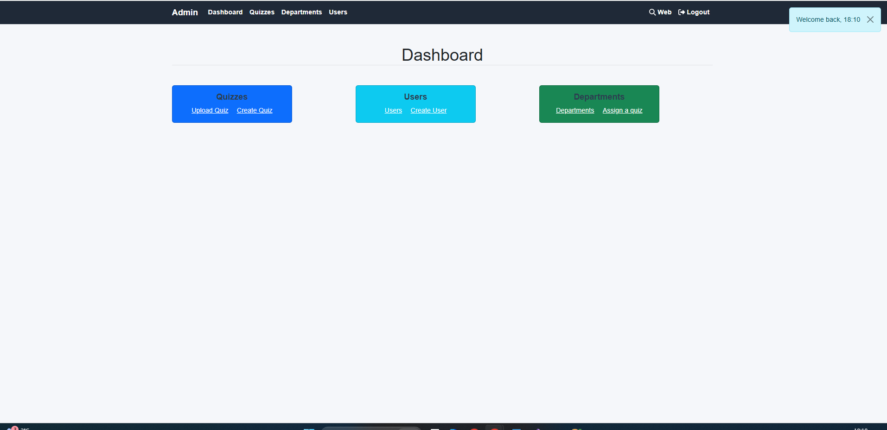
  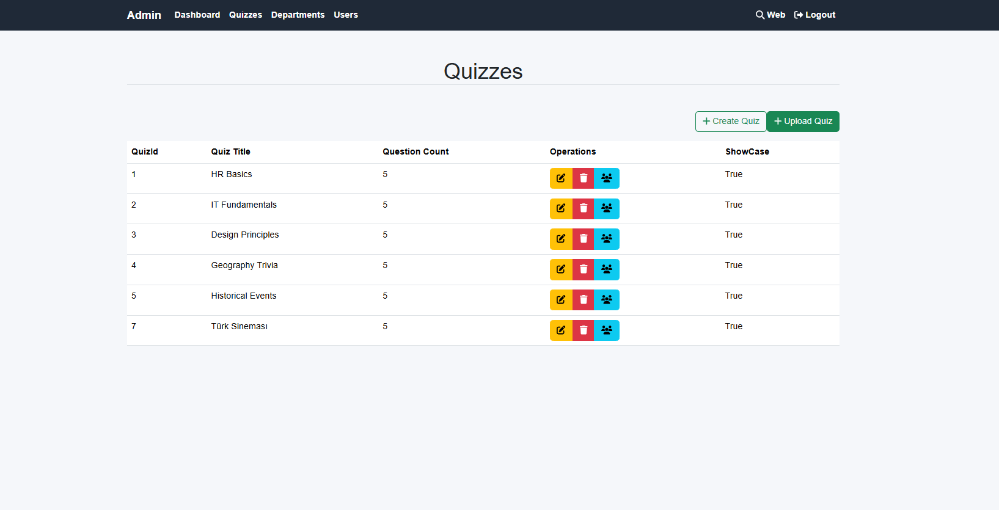
  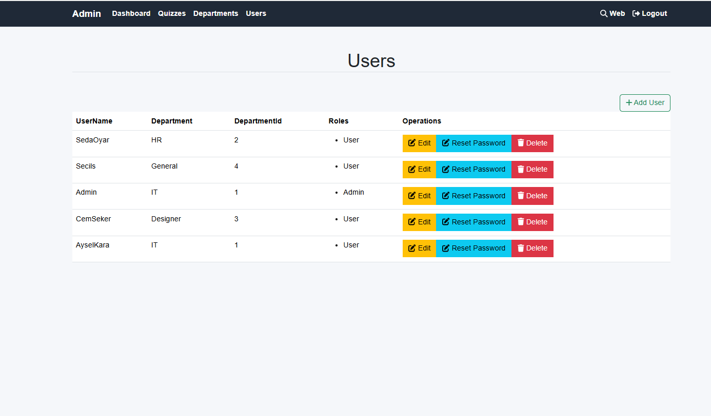
</div>

### Admin Quiz Management
<div style="align="center"">
  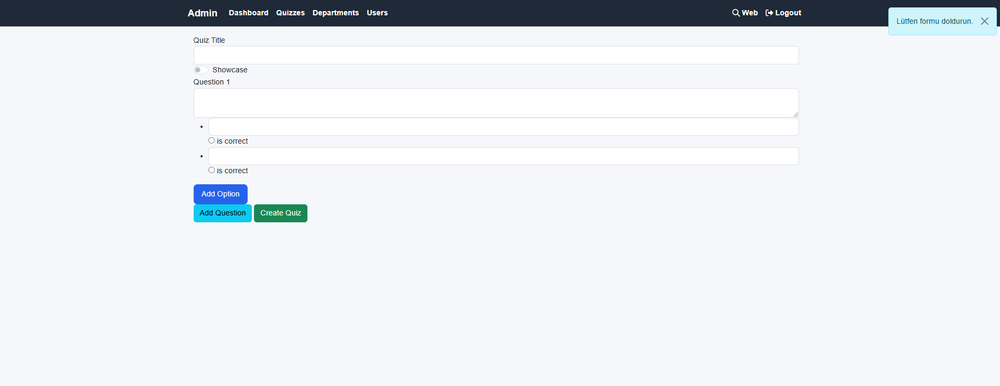
  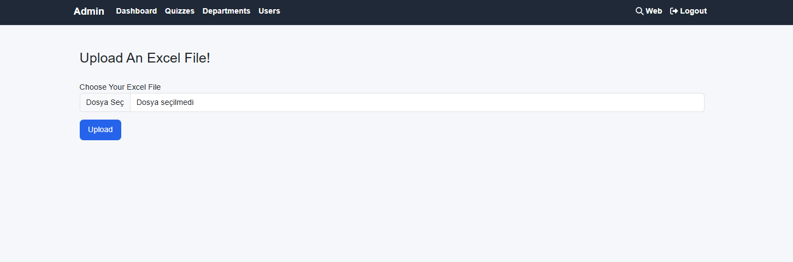
  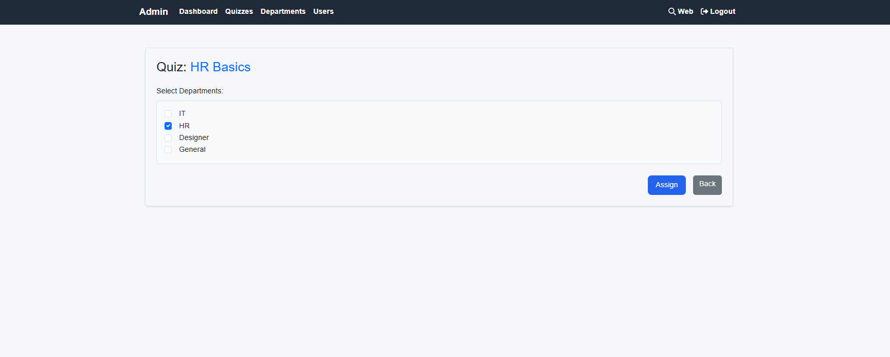
</div>

### Admin User Management
<div style="align="center"">
  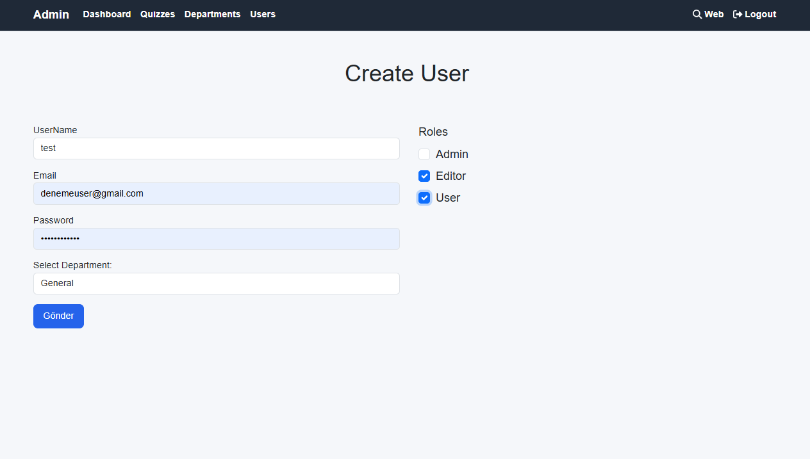
</div>

### Guest Pages
<div style="align="center"">
  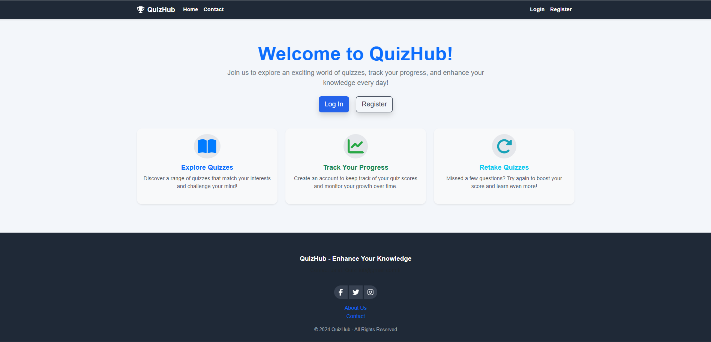
  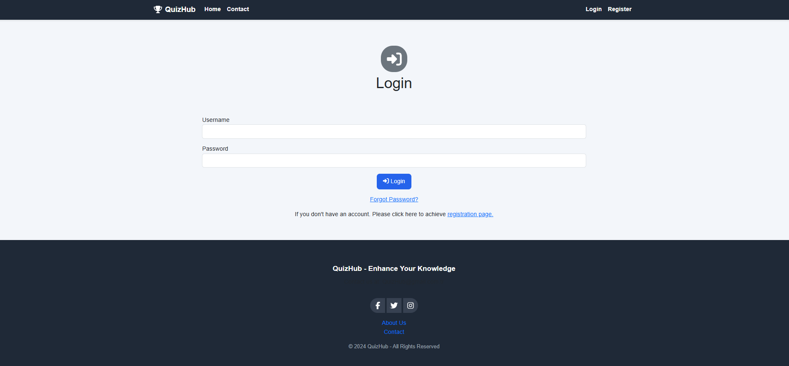
  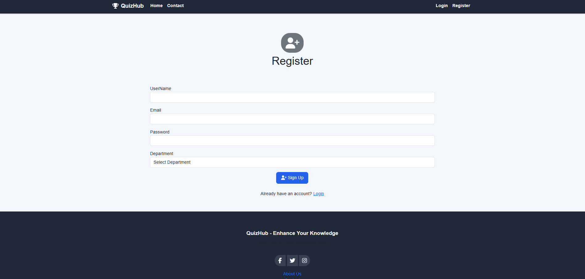  
</div>

### User Views
<div style="align="center"">
  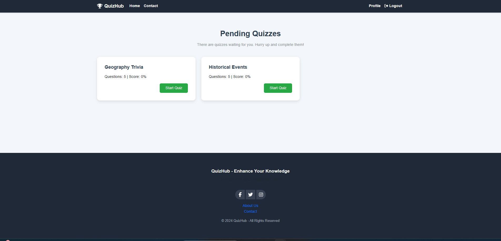
  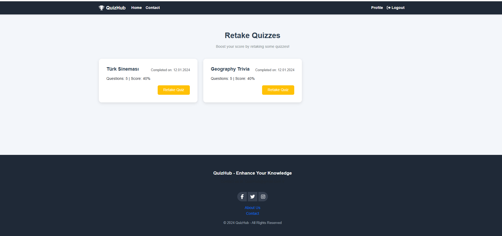
  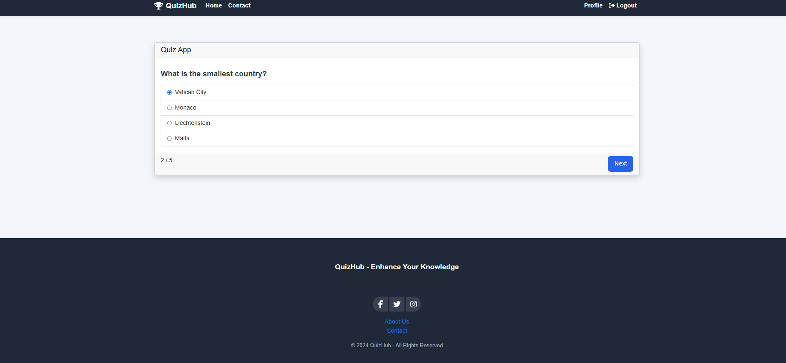  
  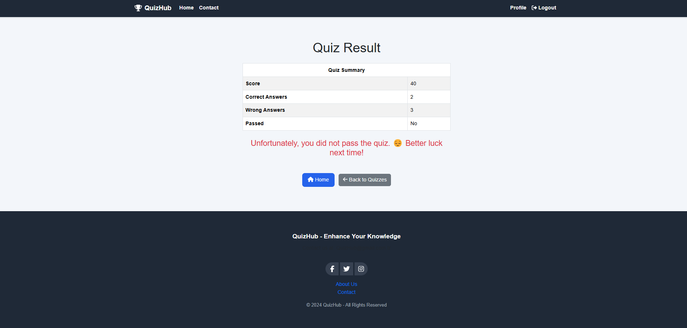
</div>

## 🛠 How to Run
### 1. Clone the Repository
   ```bash
   git clone https://github.com/secilseleci/QuizHub.git
```

### 2. Navigate to the API Directory
 ```bash
cd QuizHub
```

### 3- Open the QuizHub.sln file with a code editor (preferably Visual Studio)
  ```bash
start QuizHub.sln
```

### 4- Open WebUI project folders
Find appsettings.json file and change the connection string with yours.


### 5- Open Package Manager Console and Run Command Below
  ```bash- 
  update-database
```
*All data will be seeded to your database

### 6- Run the program
Login Credential

username:
```bash
Admin
```

password:
```bash
Admin+123456
```
